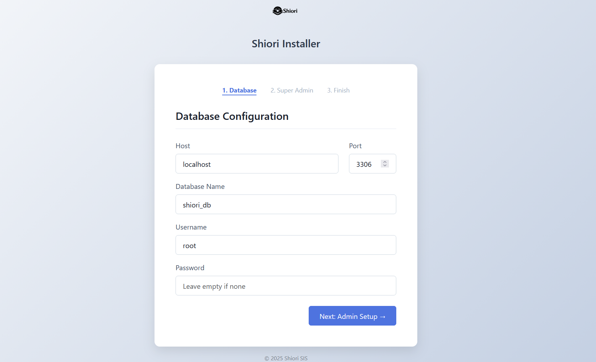
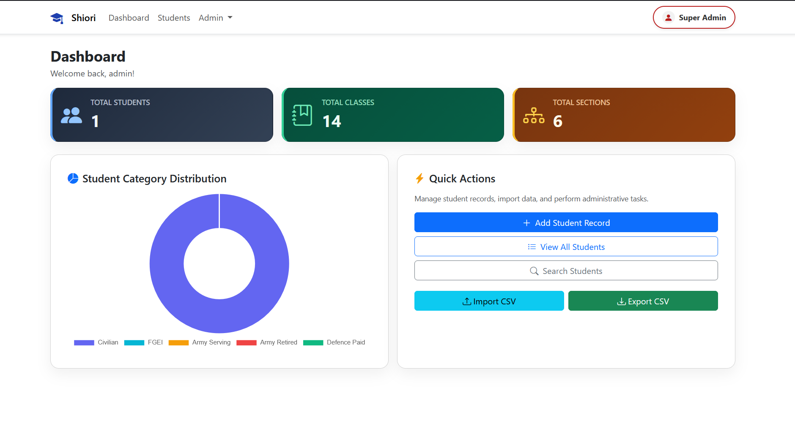
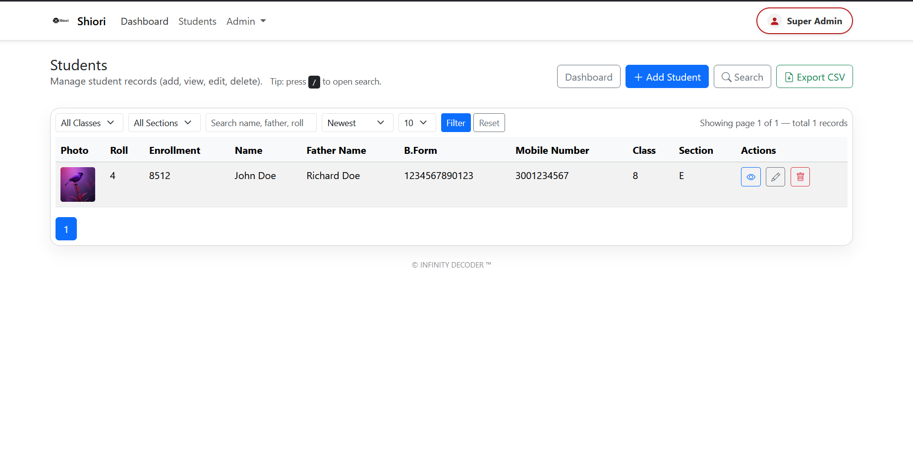
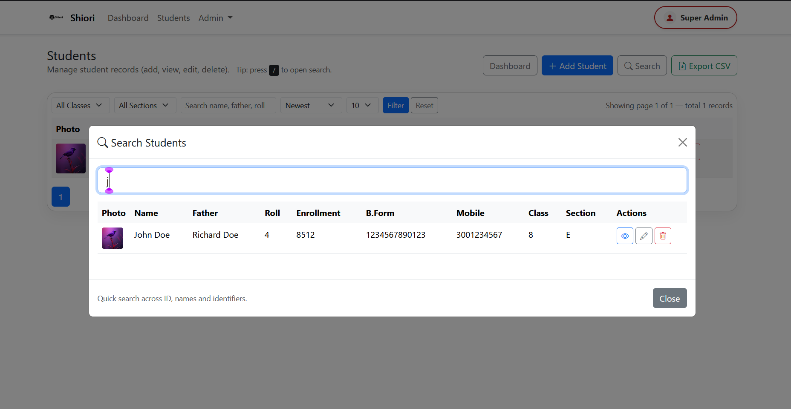
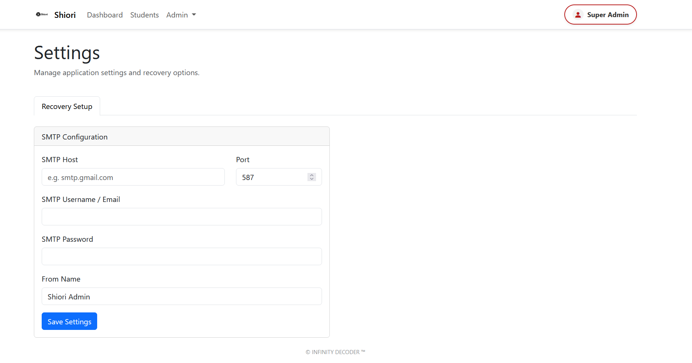
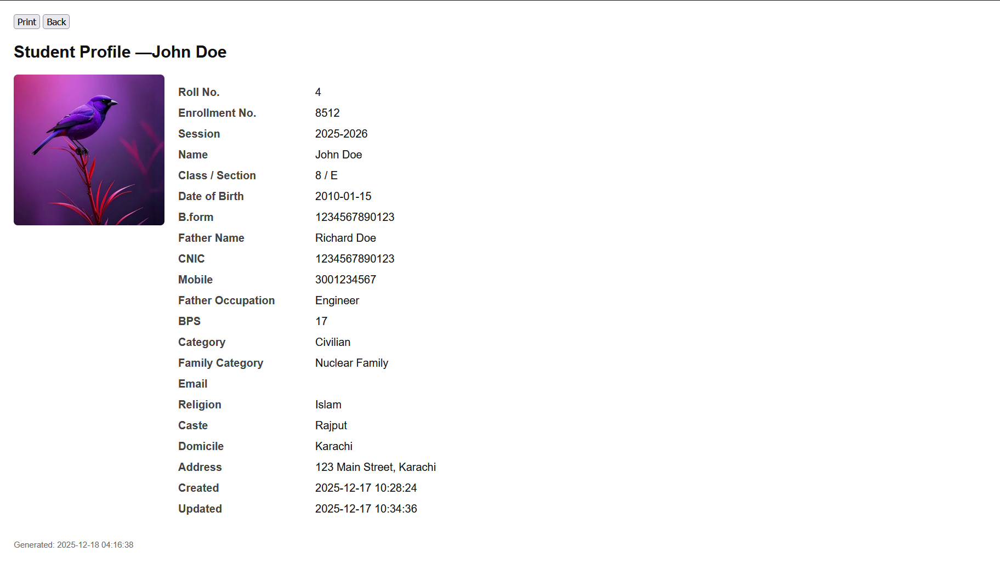

<h1 style="font-family: 'poppins'; font-weight: bold; color: Green;">👨‍💻Author: INFINITY DECODER</h1>

[](https://github.com/infinity-decoder) 
[](https://www.kaggle.com/infinitydecoder) 
[](https://pk.linkedin.com/in/infinitydecoder)  
[](https://www.facebook.com/infinitydecoder.me) 
[](https://www.coursera.org/learner/infinitydecoder) 
[](https://www.coursera.org/learner/infinitydecoder) 
[](https://profile.infinitydecoder.com/) 
[](mailto:contact@infinitydecoder.com)

---

# 📚 Shiori — Student Management System

**Shiori** is a modern, lightweight, and secure Student Information System (SIS) built with vanilla PHP and a clean MVC architecture. It's designed for schools and educational institutions that need a fast, simple, and reliable solution without the overhead of large frameworks.

---

[](https://github.com/infinity-decoder/Shiori/releases/tag/v1.0.0)
[](#)
[](#)

[](https://github.com/infinity-decoder/Shiori/releases/tag/v1.0.0)

## 🚀 Features

- ✅ **Student Management**: Add, edit, delete, search, and view student records
- ✅ **Photo Management**: Upload student photos with automatic thumbnail generation
- ✅ **CSV Import/Export**: Bulk import students from CSV files
- ✅ **Dynamic Fields**: Create custom fields (text, select, radio, etc.)
- ✅ **Lookup Management**: Manage classes, sections, sessions, categories
- ✅ **User Management**: Multi-role support (Super Admin, Admin, Staff, Viewer)
- ✅ **Activity Logging**: Track all CRUD operations
- ✅ **Password Security**: Mandatory password changes, strength validation
- ✅ **Database Backup**: One-click MySQL database backup
- ✅ **Responsive Design**: Mobile-friendly Bootstrap 5 interface
- ✅ **Installer Wizard**:  installer for easy setup


---
<p align="right">(<a href="#readme-top">back to top</a>)</p>


## 📦 Installation

### Option 1: Using the Installer (Recommended)

1. **Clone or Download the Repository**
   ```bash
   git clone https://github.com/infinity-decoder/Shiori.git
   cd Shiori
   ```

2. **Configure Your Web Server**
   - **Laragon/XAMPP**: Place the `Shiori` folder in your `www` or `htdocs` directory
   - **Production**: Set your web server document root to the `/public` folder

3. **Set Permissions**
   ```bash
   chmod -R 755 public/uploads/
   chmod -R 755 storage/
   ```

4. **Access the Installer**
   - Navigate to: `http://localhost/Shiori/public` or your configured URL
   - The installer will automatically launch if the database is not configured
   - Follow the 3-step wizard:
     - **Step 1**: Database Configuration
     - **Step 2**: Super Admin Account
     - **Step 3**: Review & Install

5. **Login**
   - Use the credentials you created during installation

### Option 2: Manual Installation

1. **Create Database**
   ```sql
   CREATE DATABASE shiori_db CHARACTER SET utf8mb4 COLLATE utf8mb4_unicode_ci;
   ```

2. **Import Schema**
   ```bash
   mysql -u root -p shiori_db < database/schema.sql
   ```

3. **Configure Database**
   
   Create `config/database.php`:
   ```php
   <?php
   return [
       'host'    => 'localhost',
       'port'    => 3306,
       'name'    => 'shiori_db',
       'user'    => 'root',
       'pass'    => '',
       'charset' => 'utf8mb4',
   ];
   ```

4. **Configure Application**
   
   Edit `config/app.php`:
   ```php
   <?php
   return [
       'name'     => 'Shiori',
       'base_url' => 'http://localhost/Shiori/public',
       'debug'    => false,
   ];
   ```


### Base URL Configuration

The `base_url` in `config/app.php` must match your server setup:

**Local Development (Laragon/XAMPP):**
```php
'base_url' => 'http://localhost/Shiori/public',
```

**Production (Domain Root):**
```php
'base_url' => 'https://yourdomain.com',
```

**Production (Subdirectory):**
```php
'base_url' => 'https://yourdomain.com/shiori',
```
<p align="right">(<a href="#readme-top">back to top</a>)</p>


---

## 👤 User Roles & Permissions

| Role | Permissions |
|------|-------------|
| **Super Admin** | Full access - manage users, fields, lookups, students, settings |
| **Admin** | Manage students, lookups, view activity logs |
| **Staff** | Add/edit students, view records |
| **Viewer** | Read-only access to student records |

---

## 📁 Project Structure

```
Shiori/
├── app/
│   ├── Controllers/       # Request handlers
│   ├── Core/             # Router, Auth, CSRF, DB
│   ├── Models/           # Database models
│   ├── Services/         # Business logic
│   ├── Views/            # HTML templates
│   └── Helpers/          # Utility functions
├── config/
│   ├── app.php           # Application settings
│   └── database.php      # Database credentials (auto-generated)
├── database/
│   └── schema.sql        # Database schema
├── public/
│   ├── assets/           # CSS, JS, images, fonts
│   ├── uploads/          # Student photos (writable)
│   └── index.php         # Front controller
└── storage/              # Logs and temporary files
```
<p align="right">(<a href="#readme-top">back to top</a>)</p>


## 📸 Screenshots





<p align="right">(<a href="#readme-top">back to top</a>)</p>







<p align="right">(<a href="#readme-top">back to top</a>)</p>


<p align="right">(<a href="#readme-top">back to top</a>)</p>





<p align="right">(<a href="#readme-top">back to top</a>)</p>



---

## 🤝 Contributing

Contributions are welcome! Please feel free to submit a Pull Request.

> [!Top Contributors]
<a href="https://github.com/infinity-decoder/Shiori/graphs/contributors">
  
</a>

<p align="right">(<a href="#readme-top">back to top</a>)</p>

---

## 📄 License

This project is open-source and available under the [MIT License](LICENSE).

---

## 🙏 Acknowledgments

- Bootstrap Team for the amazing UI framework
- Chart.js for beautiful charts
- SweetAlert2 for elegant alerts
- All contributors and testers

---
<p align="right">(<a href="#readme-top">back to top</a>)</p>

<div align="center">

**Made with ❤️ by [INFINITY DECODER](https://profile.infinitydecoder.com/)**

⭐ Star this repo if you find it helpful!

</div>
